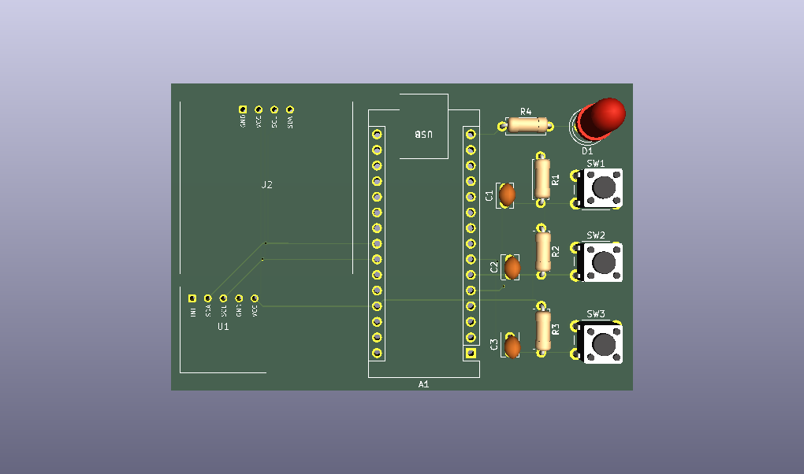

This is a simple heartbeat monitor PCB I made while practicing my PCB design skills, it uses an Arduino Nano v3, MAX30102 as the heartrate monitor module, and an SS1306 OLED display for showing the heartrate of the user.

